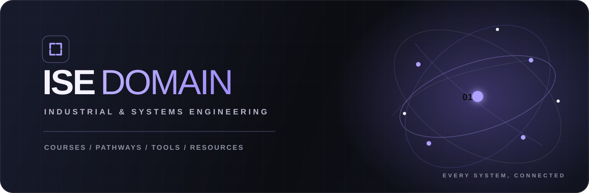

  

# ISE Domain

A bilingual, responsive introduction to Industrial and Systems Engineering. Built on the existing React 19 / TypeScript / vinext / Tailwind / Sites project.

## Run

- `npm install` if dependencies are absent (Node 22.13+).
- `npm run dev` for the local preview.
- `npm run build` for Cloudflare Workers/Sites output.
- `npx tsc --noEmit` and `node scripts/validate-data.mjs` for code and curriculum checks.
- `npx oxlint app components/domain-app.tsx components/explorer.tsx components/site-link.tsx lib` for authored application code. The full starter lint includes pre-existing errors in unused vendored `components/ui` files and `hooks/use-mobile.ts`; those are intentionally preserved.

## Routes and preferences

`/en` and `/fa` contain the overview. Each locale has `/chart`, `/majors`, `/tools`, `/resources`, and `/wikipedia` routes. The root route restores the previous language, defaulting to English. Dark mode is the initial theme; preferences are saved in browser local storage.

Chart views and filters use URL parameters (`view`, `category`, `group`, `pathway`, `q`, `course`). Filters update immediately without server requests. Language links retain query parameters, including the selected course. There is no account system, database, or runtime AI service.

Module links use native document navigation through `components/site-link.tsx`. This avoids a verified production-only prefetch/click failure in the starter's vinext RSC Link runtime. Browser back/forward, URL selections, language and theme preferences remain available.

## Content and provenance

- The original workbook is authoritative: 81 undergraduate courses, 140 required credits (21 + 66 + 22 + 22 + 6 + 3), and the supplied overlapping subject categories.
- Three healthcare courses remain supplementary; seven graduate pathways and three supporting groupings reproduce the workbook mappings.
- Missing elective credits, prerequisite relationships and source references are enriched from the supplied 1403 PDF. The elective pool's sum is distinct from the 22-credit graduation requirement.
- Bilingual introductions are editorial summaries. Workbook degree groupings and PDF syllabus details remain distinct.
- `lib/data/courses.json`, `pathways.json`, and `tools.json` are the published typed catalog. Source records retain sheet/range or PDF page references. The public PDF is a byte-for-byte copy; the source workbook and its personal commentary are not published.
- `scripts/course-content.tsv`, `pathway-content.json`, and `tool-content.tsv` hold editable descriptions and mappings. Run `scripts/import-catalog.py` with Python containing openpyxl and pypdf, then `scripts/enrich-catalog.py` (requires internet access) to rebuild JSON. Keep the original workbook and PDF in the project root when rebuilding.
- The enrichment script verifies Wikipedia article existence, follows redirects, excludes disambiguation pages, and validates Persian language links. Missing Persian articles are displayed honestly. Links are related-topic articles, not university course pages.
- `lib/resources.ts` holds the curated library and source URLs. Two Persian books link to their curriculum bibliography, not unauthorized book copies.
- Tool aliases are reconciled explicitly, including combined NumPy/SciPy, Python/R, Odoo, and SQL Server/Power Query entries. No positional name-to-URL matching is used.
- `scripts/check-links.py` audits outbound links and writes `tmp/link-audit.json`. Some vendors reject automated requests; those destinations were additionally confirmed through official-site search results. JMP's outdated route was corrected; Epi Info's discontinued development is identified from CDC's current notice.

## Replace backgrounds

Edit `categories` in `lib/domain-config.ts` to change the asset URL, desktop focal position, mobile focal position and accent. The five supplied SVGs are unchanged. The other engineering category and all non-category pages use simple backgrounds. `Satoru-Gojo-Hollow-Purple.svg` is not referenced.

## Validation

Data checks cover course identity, degree and category totals, accounting overlap, supplementary-course separation, prerequisite and pathway references, software consolidation, bilingual content and Wikipedia destinations. Browser QA covers responsive layouts, language/theme controls, search, filters and course dialogs. Reduced-motion media queries disable decorative transitions. Native links and accessible Base UI tabs/dialogs support keyboard use.

## Deployment

Reuse the existing `.openai/hosting.json` Sites project. Build, push the exact validated source with a short-lived credential, package using the Sites hosting helper, save that commit's version, and deploy to the project's existing audience. Never put source credentials in files or Git configuration.
